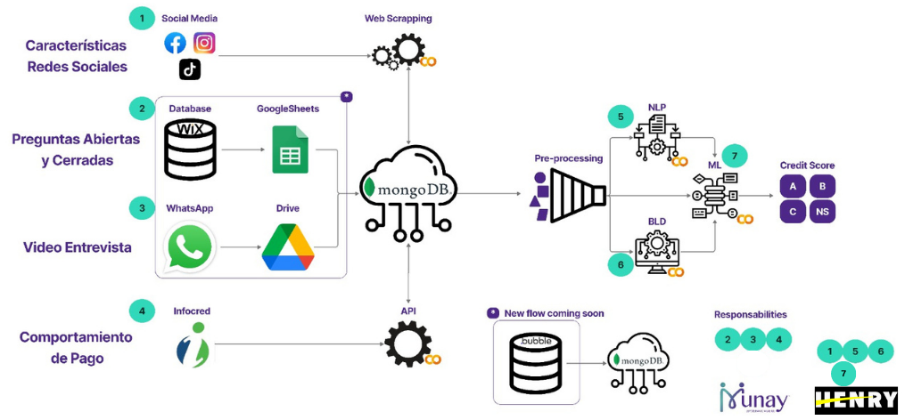

## ALGORITMOS INTEGRADOS PARA EVALUAR PUNTAJE CREDITICIO
###### Por Alan Ignacio, Daineth Domínguez, Isaías Martínez, Miguel Vázquez y Nancy Contreras , estudiantes de la carrera Data Science en [Soy Henry](http://https://www.soyhenry.com/?utm_source=google&utm_medium=cpc&utm_campaign=GADS_SEARCH_MEX_BRAND&utm_content=Brand&gad=1&gclid=CjwKCAjwhJukBhBPEiwAniIcNbyXF-NP0qG0EJV5DpncHdjQf96v7MGxR_PIr85AXQ8CoHTHIGx78RoC89AQAvD_BwE "Soy Henry")

   
   

## **Introducción**

Bienvenidos a nuestro primer proyecto en equipo en colaboración con la Fintech SoyMunay con sede en Bolivia. Dicho proyecto se basa en desarrollar tres componentes que se utilizarán para automatizar la asignación de créditos, con el objetivo de obtener de una manera veloz, eficaz y certera valores numéricos para incluirlos como datos no tradicionales a un algoritmo ML. Para el desarrollo de este algoritmo se ha trabajado en tres bloques que serán desarrollados de forma explícita a lo largo de este documento:

1. Un algoritmo de Procesamiento del Lenguaje Natural (NLP) que puntúa el grado de conocimiento (métricas de impacto) y motivación (continuidad del negocio) de los emprendedores a partir de preguntas abiertas. 

2. Un algoritmo Body Language Decoder (BLD) para clasificar en positivo o negativo el lenguaje corporal de los emprendedores en un video donde responden preguntas relacionadas con su emprendimiento.

3. Un algoritmo de Machine Learning (ML) que puede caracterizar la información no solo en sus características de capacidad de pago y riesgo, sino también en rasgos cognitivos, autopercepciones y comportamiento en redes sociales. Estos últimos se recogerán mediante web scraping.

El proyecto incluye además la creación de data sintética que se combinó con datos reales proporcionados por Munay obtenidos en un periodo de junio del 2021 a junio del 2023 provenientes de su plataforma en Wix.

## **Contexto**

Al decidir si aprueban una solicitud de préstamo, los bancos y otros prestamistas generalmente usan métodos estadísticos tradicionales de calificación crediticia con parámetros definidos; como el tiempo en el negocio, la rentabilidad, los ingresos disponibles, las calificaciones crediticias, etc., terminan siguiendo un proceso lineal y unidimensional que utiliza un conjunto de datos limitado. Por eso se ha desarrollado una evaluación de datos no tradicionales o alternativos para las solicitudes de préstamos, sin embargo, al tratarse de preguntas abiertas, análisis de videos, y realización de web scraping, toma tiempo leer, analizar, estandarizar y determinar el puntaje para cada solicitante. Por lo que es de suma importancia implementar un proyecto que mejore y reduzca el tiempo de evaluación. Agilizando así la respuesta a una solicitud de crédito.

----

## **Desarrollo del proyecto**

### *Fuente de Datos*
Debido a políticas de privacidad de la empresa para la que se desarrolló este proyecto, no se pueden compartir los datasets proporcionados.

---

###  **ETAPA 1** 
### *Procesamiento de Lenguaje Natural (NLP)*
Esta etapa del proyecto se basa en desarrollar un modelo de clasificación de texto que se utilizará para automatizar la asignación de score a ochos preguntas abiertas para los solicitantes a nano créditos en Munay. Con el objetivo de obtener de una manera veloz, eficaz y certera valores numéricos para incluirlos como datos no tradicionales a un algoritmo ML.

---
#### Librerías

    matplotlib
    nltk
    numpy
    openai
    os
    pandas
    seaborn
    sklearn
    string
    sys
---
*-> Transformación de la Base de Datos*

*   Se trabajó con 2 bases de datos: Base de datos original proporcionada por Munay y base de datos sintética, generada a partir de la API de OpenAi (él código utilizado se puede encontrar en el apartado: Preparación de data sintética para NLP).
*   La carga de datos se realizó directamente desde Google Drive, para lo cuál se necesita solicitar el acceso cada vez que se desea correr el código
*   Se separó los datsets en 8, para que cada pregunta tuviera su variable de salida
*   Cada dataset obtenido se le eliminó previamente los valores nulos, ya que, un alto porcentaje de los usuarios que solicitan el crédito no responden la totalidad de las preguntas
*   Se prosiguió a la elaboración de una función que realice previamente la tokenización, lematización y normalización del texto
*   Antes de pasar a la etapa del entrenamiento, se creo una función que vectorizara los textos con opción a 3 métodos: Bago of Word, TF-IDF y Hashing
---
*-> Modelos de Clasificación de Texto*

Se realizó una función mediante Pipeline que permitiera realizar un loop, de tal manera, que entrenara al mismo tiempo 9 algoritmos de clasificación de texto, con 3 los tipos de vectorización previamente mencionados y además, mostrara la evaluación de los modelos mediante 4 métricas (Acurracy, Precision, Recall y F1) para determinar que algoritmo se ajusta más a lo que necesitamos.

De todo esto se obtendrá una lista con los resultados para cada pregunta.

El análisis se basará en el score F1 apoyado de precision, ya que se requiere minimizar los falsos positivos, pero que también sea eficiente al predecir las 3 variables

*Para acceder al informe detallado por favor [ingresa aquí](https://github.com/NancyData/ML-in-Credit-Score/blob/main/NLP.ipynb)

---
###  **ETAPA 2** 
### *Pruebas de algoritmo BLD*

 Utilizando algoritmos de Detección del Lenguaje Corporal (BLD), estamos explorando nuevas formas de evaluar la confiabilidad de los solicitantes de microcréditos.

---
#### Librerías
    deepface
    fer
    cv2
    matplotlib
    pandas
    numpy
    time
    keras
    tensorflow
---
#### Bibliotecas
Antes de ejecutar el código, asegúrate de tener instaladas las siguientes bibliotecas:

**DeepFace:** una biblioteca que proporciona funciones de análisis facial, incluido el reconocimiento de emociones.

**OpenCV (cv2):** una biblioteca de visión por computadora que permite leer el video y procesar cada frame.

`NOTA:` Puedes instalar las bibliotecas necesarias utilizando !pip.

#### Modos de uso de los algoritmos
___

*-> DeepFace y OpenCV*

Este código es una implementación que utiliza la biblioteca DeepFace junto con OpenCV (cv2) para reconocer expresiones faciales en un video que muestra la cara de una persona. El objetivo es analizar cada frame del video, identificar la emoción facial presente en ese momento y almacenar los resultados en un DataFrame.

**Uso**
Asegúrate de tener un archivo de video.

**Resultados**
Al ejecutar el código, cada frame del video será procesado por DeepFace para identificar la emoción facial presente en ese momento. Los resultados se almacenarán en un DataFrame llamado results_df_tres. Este DataFrame tendrá dos columnas: "Tiempo" (que representa el tiempo en segundos del frame) y "Emoción" (que indica la emoción facial detectada en el frame). Si no se encuentra una cara en un frame, se guardará "Sin Cara" en la columna de emoción.

`NOTA:`  Recuerda que para detener el proceso y salir del bucle mientras se reproduce el video, simplemente presiona la tecla 'q' en tu teclado (solo sirve para entornos locales).

___ 

*-> Fer y OpenCV*

Este código utiliza la biblioteca FER (Facial Expression Recognition) junto con OpenCV para reconocer expresiones faciales en un video.

**Uso:**
- Asegúrate de tener instaladas las bibliotecas necesarias: time, cv2, fer.
- Proporciona la ruta del archivo de video en la variable "video_file".
- Establece la tasa de cuadros por segundo objetivo en la variabl "target_fps" (En algunos casos hay que hacer varias pruebas con diferentes valores para encontrar los FPS deseados)
- Especifica la ruta del archivo CSV de salida en la variable "output_csv".
- Ejecuta el código y espera a que finalice.

**Funcionamiento:**

El código lee el video utilizando OpenCV y obtiene la resolución original.
Procesa cada fotograma del video, redimensionándolo y aplicando el reconocimiento de expresiones faciales utilizando FER.

* Los resultados se almacenan en un DataFrame.
* El DataFrame se guarda en un archivo CSV especificado por "output_csv".
* Se imprime el tiempo de ejecución y la ubicación del archivo CSV con los resultados.

*Para acceder al informe detallado por favor [ingresa aquí](https://github.com/NancyData/ML-in-Credit-Score/blob/main/BLD.ipynb)

---
###  **ETAPA 3** 
### *Modelo de Machine Learning + Web Scrapping*
Se busca implementar un modelo de Machine Learning para automatizar la asignación de créditos, caracterizando información de capacidad de pago, riesgo, rasgos cognitivos, autopercepciones y comportamiento en redes sociales de los solicitantes.

----

#### **Web Scraping de redes sociales**
----
Aplicación para la recolección de datos y análisis de redes sociales de empresas, con el fin de generar métricas alcanzables para estas mismas.

##### Librerias utilizadas
----
    gspread
    facebook-scraper
    instagrapi
    pymongo
    re
    random
    time

##### Bibliotecas
Antes de ejecutar el código, asegúrate de tener instaladas las siguientes librerias:

* **[facebook-scraper](https://github.com/kevinzg/facebook-scraper)**: es una libreria que permite extraer datos sobre las publicaciones en páginas de Facebook.
Ejemplo: Fecha de publicación, cantidad de likes, cantidad de comentarios.

* **[instagrapi](https://github.com/adw0rd/instagrapi)**: es una libreria que permite extraer datos sobre perfiles de Instagram.
Ejemplo: Cantidad de seguidores, fecha de publicación, cantidad de likes, cantidad de comentarios.

* **[gspread](https://docs.gspread.org/en/v5.10.0/)**: es una libreria que permite conectar con el archivo de Google Sheets donde tenemos los datos de los clientes.

* **[pymongo](https://pymongo.readthedocs.io/en/stable/index.html)**: es una libreria que permite conectar con la base de datos en MongoDB donde guardaremos los datos de los clientes, así como las nuevas métricas de estos mismos.

`NOTA:` Puedes instalar las bibliotecas necesarias utilizando !pip.

----

##### Uso
1. Se deberá realizar la conexión con Google Sheets utilizando el archivo JSON generado desde el archivo de Google Sheets.
Igualmente se deberá utilizar el link del archivo de Google Sheets para realizar la conexión.
2. Se deberá iniciar sesión en Facebook e Instagram, de preferencia con cuentas falsas, ya que es posible que nos baneen al realizar la recolección de datos.
3. Una vez realizada la conexión e iniciadas las sesiones, se correrá el loop para scrapear información por cada cliente que tengamos en nuestra base de datos.
4. Se debe iniciar sesión en MongoDB en el navegador y agregar nuestra IP a la base de datos, una vez agregada la IP, se deberá realizar la conexión con la base de datos a utilizar.
5. Se insertaran los datos de cada cliente a la base de datos en MongoDB.

##### Resultados
Se habrán extraido y agregado a la fila de cada cliente las siguientes métricas:

Facebook:
* Fecha de la última publicación en Facebook.
* Promedio de días entre publicaciones en Facebook.
* Promedio de likes por publicación en Facebook.
* Promedio de comentarios por publicación en Facebook.
* Promedio de shares por publicación en Facebook.

Instagram:
* Cantidad de seguidores en Instagram.
* Cantidad de publicaciones en Instagram.
* Fecha de la última publicación en Instagram.
* Promedio de días entre publicaciones en Instagram.
* Promedio de likes por publicación en Instagram.
* Promedio de comentarios por publicación en Instagram.

Para acceder al informe detallado por favor [ingresa aquí](https://github.com/NancyData/ML-in-Credit-Score/blob/main/Web%20scraping.ipynb)
___

#### **Modelo de Machine Learning**

------------
En este proceso, se identifican cuatro aspectos clave para el éxito de la predicción:

1. Elección del modelo de ML adecuado.
2. Selección de características relevantes.
3. Transformación efectiva de los datos.
4. Diseño de una estructura de validación adecuada.

Para abordar estos aspectos, se realiza un análisis detallado combinando diferentes modelos con sus respectivas métricas, con el objetivo de determinar el mejor modelo para predecir el credit score.

El modelado se realiza utilizando la librería de código abierto y de bajo nivel `PyCaret`, que permite agilizar el proceso desde la preparación de los datos hasta el despliegue del modelo en pocos minutos. Se realizan iteraciones eficientes para llegar a conclusiones más rápidamente, probando tres métodos diferentes de selección de características: **Univariate, Classic y Sequential**, y siete modelos de clasificación binaria: **Logistic Regression, KNN, Support Vector Machine linear y radial, Naive Bayes, Decision Tree y Multi-Layer Perceptron**. Además, se utilizan dos modelos de ensambles: **Random Forest y XG Boost**.

La evaluación de los modelos se realiza utilizando dos métricas principales: **Accuracy** y **F1-score**. Se emplean técnicas adicionales como validación cruzada y optimización de hiperparámetros a partir de Grid Search para obtener resultados más precisos.

De esta manera, se construye un árbol de decisión que permite seleccionar el modelo con las mejores características para llevar a cabo la predicción del credit score de manera eficiente y precisa.

Se recomienda consultar la documentacion de la libreria en este enlace [PyCaret](https://pycaret.readthedocs.io/en/latest/api/classification.html)

*Para acceder al informe detallado por favor [ingresa aquí](https://github.com/NancyData/ML-in-Credit-Score/blob/main/ML.ipynb)

---
## [VIDEO YOUTUBE](https://youtu.be/op9316c6Tr8)
Puedes ver el video con una explicación de la problemática y objetivo del proyecto haz click en el siguiente enlace:

`<link>` https://youtu.be/op9316c6Tr8

---

  <h1 align = 'Center'> ¡Gracias!

